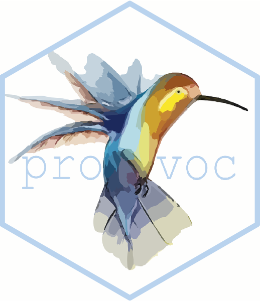

<!-- README.md is generated from README.Rmd. Please edit that file -->

# provoc <a href='https://github.com/JHuguenin/provoc'></a>

<!-- [](https://github.com/mitchelloharawild/icons/actions?workflow=R-CMD-check) -->
<!-- [](https://www.tidyverse.org/lifecycle/#experimental) -->
<!-- [](https://cran.r-project.org/package=provoc) -->
<!-- [](https://codecov.io/gh/mitchelloharawild/icon?branch=master) -->

The `provoc` package for R makes adding web icons to reports,
presentations and apps easy. It integrates many popular icon libraries
from around the web with a simple interface that works with any
`rmarkdown` output format. If a particular icon library is not
explicitly supported by this package, you can still use it by creating a
custom icon set from a folder of SVG files. Icons provide flexible means
of digital expression, allowing expressions and functionality beyond
what is possible with emoji.

The `provoc` package currently provides helpful tools for downloading
and using icons from these libraries:

# Installation

The **development** version can be installed from GitHub using:

``` r
# install.packages("remotes")
remotes::install_github("jhuguenin/provoc")
```

Once you’ve installed the package you’ll also need to download some
icons! Supported icon libraries (listed above) can be downloaded using
the `download_*()` functions. For example, to download the Font Awesome
icons you would use `download_fontawesome()`.

# Usage

``` r
library(provoc)
```

Icons can be inserted inline using inline Icons can also be inserted
using usual R chunks.
